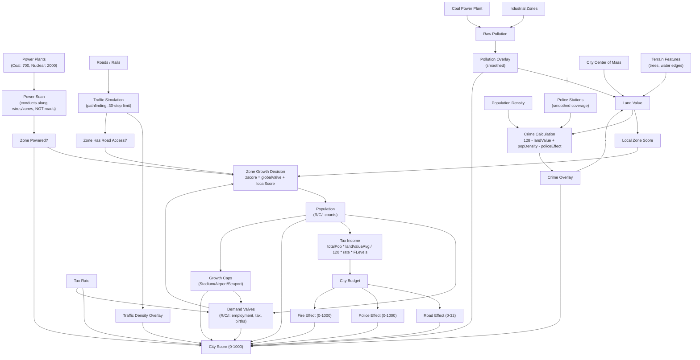

# Micropolis Game Strategy Guide

> Source-of-truth reference for AI agents. Every number comes directly from the engine source code.
> Use this to reason about cause-and-effect before spending money or placing tiles.
> Use the strategic_plan tool to generate objectives aligned with these mechanics.

---

## 1. Buildable Objects

### Construction Costs

| Object | Tool | Size | Base Cost | Notes |
|--------|------|------|-----------|-------|
| Residential Zone | `RESIDENTIAL` | 3x3 | $100 | Houses up to 40 pop per zone |
| Commercial Zone | `COMMERCIAL` | 3x3 | $100 | Up to 40 pop per zone |
| Industrial Zone | `INDUSTRIAL` | 3x3 | $100 | Up to 32 pop per zone, causes pollution |
| Road | `ROADS` | 1x1 | $10 | Bridge over water: $50 |
| Rail | `RAIL` | 1x1 | $20 | Underwater tunnel: $100 |
| Power Line | `WIRE` | 1x1 | $5 | Underwater: $25 |
| Park | `PARK` | 1x1 | $10 | Boosts land value |
| Police Station | `POLICE` | 3x3 | $500 | Reduces crime in radius |
| Fire Station | `FIRE` | 3x3 | $500 | Reduces fire risk in radius |
| Coal Power Plant | `POWERPLANT` | 4x4 | $3,000 | 700 power units, causes pollution |
| Nuclear Power Plant | `NUCLEAR` | 4x4 | $5,000 | 2,000 power units, meltdown risk |
| Stadium | `STADIUM` | 4x4 | $5,000 | Unlocks residential growth cap |
| Seaport | `SEAPORT` | 4x4 | $3,000 | Unlocks industrial growth cap |
| Airport | `AIRPORT` | 6x6 | $10,000 | Unlocks commercial growth cap |

### Annual Maintenance Costs

| Item | Cost Formula | Details |
|------|-------------|---------|
| Police Station | $100 per station per year | Underfunding reduces `policeEffect` |
| Fire Station | $100 per station per year | Underfunding reduces `fireEffect` |
| Roads + Rails | `(roadTiles + railTiles * 2) * RLevels[difficulty]` | Rails cost 2x roads in maintenance |
| Road bridges | Count as 4 road tiles each | Higher maintenance |

**Difficulty multipliers (`RLevels`):** Easy=0.7, Medium=0.9, Hard=1.2

**Tax income multiplier (`FLevels`):** Easy=1.4, Medium=1.2, Hard=0.8

---

## 2. Simulation Systems — Dependency Graph



### Key Causal Chains

1. **Power -> Growth:** Without power, `zscore = -500` — zones cannot grow regardless of demand.
2. **Roads -> Growth:** Without road access, `localScore = -3000` (residential/commercial) or `-1000` (industrial) — nearly guaranteed shrinkage.
3. **Pollution -> Land Value -> Crime -> Land Value:** Industrial zones and coal plants create pollution, which lowers land value, which raises crime, which further lowers land value. A reinforcing negative loop.
4. **Tax Rate -> Valves -> Growth -> Population -> Tax Income:** Higher taxes suppress demand valves, slowing growth and reducing the tax base. Lower taxes stimulate growth but reduce per-capita income.
5. **Funding -> Score:** Underfunded police/fire/roads directly penalize the city score through multiplicative factors.

---

## 3. Zone Growth Mechanics

Growth and shrinkage are evaluated per zone tile every 8 simulation cycles (1/8 chance per cycle, except empty residential zones which are checked every cycle).

### Growth Decision Formula

```
zscore = globalValve + localScore

if (!powered)  zscore = -500

GROW  if: zscore > -350  AND  (zscore - 26380) > random(-32768..32767)
SHRINK if: zscore <  350  AND  (zscore + 26380) < random(-32768..32767)
```

The random comparison means: at `zscore = 0`, growth probability is roughly 50%. Strongly positive zscore nearly guarantees growth; strongly negative nearly guarantees shrinkage.

### Local Score Functions

| Zone Type | Function | Formula | Range |
|-----------|----------|---------|-------|
| Residential | `evalResidential` | `max(0, landValue - pollution) * 32`, capped at 6000, then `-3000` | -3000 to +3000 |
| Commercial | `evalCommercial` | `comRate[y/8][x/8]` (distance to city center of mass: `64 - dist/4`) | ~0 to +64 |
| Industrial | `evalIndustrial` | Traffic OK? `0`. No road? `-1000` | -1000 or 0 |

**Implication:** Residential growth is highly sensitive to land value and pollution. Commercial growth favors locations near the city center. Industrial growth is indifferent to location quality — only power and road access matter.

### Value Classes (Building Appearance)

`getCRValue()` determines which density/quality variant gets placed:

| Class | Land Value - Pollution | Meaning |
|-------|----------------------|---------|
| 0 | < 30 | Slum / low-quality |
| 1 | 30–79 | Low-medium |
| 2 | 80–149 | Medium-high |
| 3 | >= 150 | Premium |

### Population Per Zone

- **Residential:** 0, 16, 24, 32, 40 (density levels), plus up to 8 individual houses around empty zones
- **Commercial:** 0 to 40 in steps of 8 (5 density levels x 4 value classes)
- **Industrial:** 0 to 32 in steps of 8 (4 density levels), pollution value 50

---

## 4. Demand System (Valves)

The three valves (`resValve`, `comValve`, `indValve`) represent global demand pressure. They are updated every ~2 simulation weeks via `setValves()`.

### Valve Update Formula

```
employment   = (historyCom + historyInd) / normResPop    // job availability
migration    = normResPop * (employment - 1)
births       = normResPop * 0.02
projectedRes = normResPop + migration + births

laborBase    = clamp(historyRes / (historyCom + historyInd), 0.0, 1.3)
internalMkt  = totalPop / 3.7
projectedCom = internalMkt * laborBase

projectedInd = indPop * laborBase * difficultyFactor
               // Easy=1.2, Medium=1.1, Hard=0.98; minimum 5

ratio        = clamp(projected / actual, max 2.0)
delta        = (ratio - 1) * 600 + TaxTable[taxEffect + gameLevel]

valve       += delta   // accumulates over time
```

### TaxTable (index 0–20)

```
[200, 150, 120, 100, 80, 50, 30, 0, -10, -40, -100,
 -150, -200, -250, -300, -350, -400, -450, -500, -550, -600]
```

Index = `taxEffect + gameLevel`. Lower index = more growth stimulus. At index 7 (neutral), TaxTable = 0. Above 7, increasingly negative — actively suppresses demand.

**Key insight:** On Easy (gameLevel=0), a tax rate that produces `taxEffect=7` gives TaxTable[7]=0 (neutral). On Hard (gameLevel=2), the same taxEffect gives TaxTable[9]=-40 (penalty). Keep taxes lower on harder difficulties.

### Valve Ranges

| Valve | Min | Max |
|-------|-----|-----|
| Residential | -2000 | +2000 |
| Commercial | -1500 | +1500 |
| Industrial | -1500 | +1500 |

### Growth Caps (Critical Thresholds)

| Cap | Condition | Effect | Solution |
|-----|-----------|--------|----------|
| `resCap` | `resPop > 500` AND no Stadium | `resValve` clamped to 0 (no positive growth) | Build Stadium ($5,000) |
| `comCap` | `comPop > 100` AND no Airport | `comValve` clamped to 0 | Build Airport ($10,000) |
| `indCap` | `indPop > 70` AND no Seaport | `indValve` clamped to 0 | Build Seaport ($3,000) |

Additionally, each active cap multiplies the city score by **0.85** (15% penalty).

---

## 5. Overlay Systems

### Land Value

Calculated per 2x2 tile block in `ptlScan()`:

```
landValue = distanceToCenter + terrainBonus - pollution
if (crime > 190): landValue -= 20
if (no developed land in block): landValue = 0
```

Factors that increase land value: proximity to city center, trees/water edges (terrain), parks, low pollution, low crime.

### Pollution

Source: tile-level `pollutionValue` attribute from `tiles.rc`. Industrial zones and coal plants are the primary sources (pollution=50 for industry, pollution=100 for coal/ports). Smoothed across the map.

### Crime

```
crime = 128 - landValue + populationDensity - policeEffect
```

Clamped to 0–255. High density + low land value + no police = maximum crime.

### Police / Fire Coverage

- Stations contribute to an 8x8-cell grid map
- Value per station = `effect` (from budget funding); halved without power; halved again without adjacent road
- Grid is smoothed 3 times — creating a soft falloff, not a hard radius
- Effective coverage: roughly 15–20 tiles from station center

### Traffic

- Only **road tiles** accumulate traffic density (not rail tiles)
- Rail tiles count for pathfinding and route access, but generate no congestion
- Traffic decays over time (`decTrafficMem`)
- Traffic average is factored into score via the TRAFFIC problem

---

## 6. Scoring System

Score is calculated every `TAXFREQ=48` city-time units (coincides with tax collection).

### Step 1: Problem Severity

| Problem | Formula | Range |
|---------|---------|-------|
| Crime | `crimeAverage` | 0–255 |
| Pollution | `pollutionAverage` | 0–255 |
| Housing | `round(landValueAverage * 0.7)` | 0–~178 |
| Taxes | `cityTax * 10` | 0–200 |
| Traffic | `trafficAverage * 2.4` | 0–~612 |
| Unemployment | `clamp((resPop / ((comPop+indPop)*8) - 1) * 255, 0, 255)` | 0–255 |
| Fire | `min(firePop * 5, 255)` | 0–255 |

### Step 2: Base Score

```
avgProblem = sum(allProblems) / 3     // note: /3, not /7 — problems stack harshly
avgProblem = min(avgProblem, 256)
baseScore  = clamp((256 - avgProblem) * 4, 0, 1000)
```

### Step 3: Multiplicative Penalties

| Condition | Penalty |
|-----------|---------|
| `resCap` active | x 0.85 |
| `comCap` active | x 0.85 |
| `indCap` active | x 0.85 |
| `roadEffect < 32` | `- (32 - roadEffect)` |
| `policeEffect < 1000` | x `(0.9 + policeEffect/10000.1)` |
| `fireEffect < 1000` | x `(0.9 + fireEffect/10000.1)` |
| `resValve < -1000` | x 0.85 |
| `comValve < -1000` | x 0.85 |
| `indValve < -1000` | x 0.85 |

### Step 4: Population Growth Bonus/Penalty

```
if deltaCityPop > 0:  multiplier = deltaCityPop/cityPop + 1.0  (bonus)
if deltaCityPop < 0:  multiplier = 0.95 + deltaCityPop/(cityPop - deltaCityPop)  (penalty)
```

### Step 5: Final Adjustments

```
score -= firePop * 5        // active fires reduce score
score -= cityTax             // raw tax rate subtracted
score *= poweredZones / totalZones   // unpowered zones directly penalize
score  = clamp(score, 0, 1000)
```

### Step 6: Smoothing

```
cityScore = round((oldCityScore + newScore) / 2)
```

The score is a **moving average** — it takes multiple evaluation periods to fully reflect changes. Sudden improvements only move the score halfway toward the new value.

---

## 7. Budget Mechanics

### Tax Income Formula

```
taxIncome = round(lastTotalPop * landValueAverage / 120 * taxRate * FLevels[gameLevel])
```

Higher land value = more tax per capita. This creates a virtuous cycle: investing in land value (parks, police, low pollution) increases revenue.

### Budget Allocation (Auto-Budget Priority)

When funds are insufficient, the engine allocates in this priority:
1. **Roads/Rails** (funded first)
2. **Fire Stations** (funded second)
3. **Police Stations** (funded last)

### Financial Health & Emergency Tax Policy

Running out of funds is catastrophic — the city cannot build, services lose funding, and the score collapses from underfunded roads/police/fire. Preventing insolvency is more important than keeping taxes low.

**Fund thresholds and recommended actions:**
- **Healthy (funds > $2,000):** Keep taxes at growth-optimal level (4–7%). Focus on building and expansion.
- **Tight (funds $500–$2,000):** Raise taxes to 8–9%. Pause non-essential construction. The slight demand penalty is far less damaging than running out of money.
- **Critical (funds < $500):** Raise taxes to 10–12% immediately. Stop all construction. A temporary tax hike to refill the treasury is always better than insolvency — you can lower taxes again once funds recover above $2,000.
- **Bankrupt (funds = $0):** Set taxes to maximum sustainable level (12–15%). You cannot build anything, services lose funding, and the city decays. Recovery requires aggressive taxation until funds are restored.

**Why this matters mechanically:**
- At $0 funds, road/police/fire funding drops. `roadEffect` falls below 32 → direct score subtraction. `policeEffect` and `fireEffect` drop → multiplicative score penalties.
- A temporary tax of 12% for a few cycles costs roughly `12 * 10 = 120` points in the tax problem score. But losing road funding costs the full `(32 - roadEffect) * penalty` AND triggers cascading issues (police underfunded → crime rises → land value drops → tax income falls further).
- The engine's OUT_OF_FUNDS event triggers when the city cannot pay its obligations. This is a critical event that demands immediate action.

**Recovery pattern:** Raise taxes → wait 2–3 tax cycles for treasury to rebuild → lower taxes back to 6–7% → resume building. Never keep emergency tax rates longer than necessary — they suppress demand.

### Effect Calculation

- `roadEffect`: 0–32 scale. Full funding = 32. Below 32 directly subtracts from score.
- `policeEffect`: 0–1000 scale. Below 1000, score multiplied by `0.9 + effect/10000.1`.
- `fireEffect`: 0–1000 scale. Same formula as police.

---

## 8. Disasters

### Random Disaster Probability

Checked every simulation cycle 15. Probability: `1 / (disChance[level] + 1)` per check.

| Difficulty | `disChance` | Approx. Frequency |
|------------|-------------|-------------------|
| Easy | 480 | ~1 per 480 cycles |
| Medium | 240 | ~1 per 240 cycles |
| Hard | 60 | ~1 per 60 cycles |

### Disaster Types

| Disaster | Trigger Condition | Notes |
|----------|------------------|-------|
| Fire | Random | Spreads if no fire station coverage |
| Flood | Random | Creates flood tiles, temporary |
| Tornado | Random | Mobile sprite, destroys tiles in path |
| Earthquake | Random | Damages random tiles city-wide |
| Monster | Random, only if `pollutionAverage > 60` | Keep pollution below 60 to prevent |
| Nuclear Meltdown | Per-cycle chance per nuclear plant | Chance: `1/(MELTDOWN_TAB[level]+1)` — Easy: 1/30001, Medium: 1/20001, Hard: 1/10001 |

---

## 9. Power Conductivity (CRITICAL)

Power propagation uses a flood-fill algorithm starting from each power plant. It walks along "conductive" tiles only.

### Conductivity Table (from tiles.rc)

| Tile Type | Conducts Power? | Tile IDs | Notes |
|-----------|----------------|----------|-------|
| Power lines/wires | YES | 208-223 | Primary power conduit |
| Road+Wire crossings | YES | 77-78, 93-94, etc. | Auto-created when wire crosses road |
| Residential zones | YES | 240+ | All zone tiles conduct |
| Commercial zones | YES | 423+ | All zone tiles conduct |
| Industrial zones | YES | 612+ | All zone tiles conduct |
| Power plants | YES | 750+ (coal), 816+ (nuclear) | Source of power |
| Regular roads | **NO** | 64-76 | Roads BLOCK power! |
| Rails/railroad | **NO** | 224-239 | Rails do NOT conduct |
| Parks | **NO** | 840 | Parks do NOT conduct |
| Empty land/trees | **NO** | 0, 21-43 | Not conductive |
| Water | **NO** | 2-20 | Not conductive |

### How Power Propagation Works

1. Algorithm starts at each power plant and flood-fills along conductive tiles.
2. Adjacent zones propagate power to each other freely (no wire needed).
3. A road between two zones BREAKS the power chain (roads are NOT conductive).
4. To bridge a road, build a wire across it (creates a road+wire crossing tile that conducts).
5. Each power unit consumed by the scan counts against plant capacity (Coal: 700, Nuclear: 2000).

### Common Power Mistakes

- Expecting roads to carry power (they don't — only road+wire crossings do).
- Building zones with road gaps between them and wondering why they're unpowered.
- Not running a wire from the plant to the first zone in a chain.

### Optimal Power Layout

```
PowerPlant -> Wire -> Zone -> Zone -> Zone (power flows freely through adjacent zones)
                       |
                     Road    <-- power STOPS here
                       |
                     Wire    <-- needed to bridge the road
                       |
                     Zone -> Zone -> Zone (power resumes)
```

---

## 10. Optimal City Layout

### Three-Ring Model

The most effective city structure separates zone types into concentric rings:

```
+--------------------------------------------------+
| INDUSTRIAL  INDUSTRIAL  INDUSTRIAL  INDUSTRIAL   |  <- Map edges
|  COMMERCIAL  COMMERCIAL  COMMERCIAL  COMMERCIAL  |  <- Buffer ring
|    RESIDENTIAL  RESIDENTIAL  RESIDENTIAL          |  <- City center
|    RESIDENTIAL  RESIDENTIAL  RESIDENTIAL          |
|  COMMERCIAL  COMMERCIAL  COMMERCIAL  COMMERCIAL  |
| INDUSTRIAL  INDUSTRIAL  INDUSTRIAL  INDUSTRIAL   |
+--------------------------------------------------+
```

**Why this works:**
- Industrial at edges: ~50% of pollution spills off the map edge, and edge land has lowest value anyway.
- Commercial as buffer: Tolerates pollution better than residential, thrives on proximity to city center.
- Residential at center: Benefits from highest land value (center proximity bonus in `comRate` formula).

### Two-Zone Strip Pattern (Most Efficient Layout)

The strip pattern is a space-efficient layout for zones with integrated road access:

```
ZONE ZONE ZONE ZONE ZONE ZONE    <- Row of 3x3 zones touching each other
ZONE ZONE ZONE ZONE ZONE ZONE    <- Second row of zones
= = = = ROAD = = = = = = = =     <- Single road row
ZONE ZONE ZONE ZONE ZONE ZONE    <- Next strip
ZONE ZONE ZONE ZONE ZONE ZONE
```

**Comparison on 31x31 area:**

| Layout | Zones | Road/Rail | Density |
|--------|-------|-----------|---------|
| Donut (3x3 blocks) | 72 | 23.2 km | Low |
| Two-zone strip | 90 | 12.0 km | High |

### Road Access Rule

Each zone needs at least one tile of road or rail touching any edge of its 3x3 footprint.
The plan_city_block tool handles this automatically with road rows between zone strips.
You can also build traditional road grids — whatever creates good connectivity for your city.

### Power Layout Integration

Since zones conduct power to adjacent zones, the strip pattern also provides free power propagation:
- Connect the power plant to any zone in the strip with a wire.
- Power flows through the entire strip of touching zones automatically.
- Only need wires across road rows (one wire per road crossing point).

---

## 11. Infrastructure Strategy

### Roads: Good Infrastructure

- Each 3x3 zone needs at least one road/rail tile touching its perimeter for road access.
- Build proper road networks — zones without road access simply won't grow.
- The strip layout (road rows between zone strips) is efficient, but regular road grids work too.
- Fund roads at 100% via set_budget — underfunded roads directly subtract from your city score.
- `roadEffect` (0-32) measures road maintenance quality. Keep it at 32 by fully funding roads.

### Power Lines: Only Where Needed

- Zones propagate power for free when touching each other.
- Only build wires to bridge non-conductive gaps (roads, empty land).
- A single wire from plant to first zone chain handles everything if zones are contiguous.
- Wire cost: only $5/tile — cheap insurance for power connectivity.

### Nuclear vs Coal Power Plant ROI

| | Coal | Nuclear | Nuclear Advantage |
|--|------|---------|-------------------|
| Cost | $3,000 | $5,000 | |
| Power | 700 units | 2,000 units | 2.86x more power |
| Power/Dollar | 0.23 | 0.40 | **1.74x better ROI** |
| Pollution | YES (100) | NO | Huge land value benefit |
| Meltdown risk (Easy) | N/A | 1/30,001 per cycle | Negligible |

**Recommendation:** Always prefer nuclear when funds allow ($5,000+). The lack of pollution alone justifies the cost — pollution destroys land value, raises crime, and can trigger monster attacks (>60 pollution average).

### Rail vs Road Trade-offs

| | Road | Rail |
|--|------|------|
| Provides zone connectivity | Yes | Yes |
| Creates traffic congestion | **Yes** | No |
| Maintenance per tile | 1x | 2x |
| Conducts power | Only with wire | No |

- Use roads for general connectivity (cheaper, can combine with wire for power).
- Use rails in high-traffic corridors to reduce congestion while maintaining connectivity.
- A well-connected city with good road infrastructure is essential for growth.

### Service Building Placement

- Police stations: every ~15 tiles of developed area. Coverage halved without power or road.
- Fire stations: same spacing. One fire station early to prevent uncontrolled fires.
- Power plants: corner of the map, adjacent to industrial. No road needed.
- Stadium/Seaport/Airport: build ONE each just before growth caps activate. Don't waste space on multiples.

---

## 12. Lessons from Past Games (Empirical — from 6 collapsed cities)

These patterns caused every city to collapse. They are the most common agent failures.

### Anti-Pattern 1: "Build First, Earn Never"

In every failed session, the agent spent 75–85% of the $20,000 starting funds in the first 7 turns before any meaningful tax income existed. The result: a large, impressive city with zero financial runway.

**The fix — Budget Phases:**
- **Turns 1–3 (Bootstrap):** Spend up to $10,000 on power plant + first neighborhoods. This is your initial investment.
- **Turns 4–8 (Stabilize):** Spend conservatively ($500–$1,000/turn max). Let zones grow and generate tax income. Check `get_budget` to see actual income vs. expenses.
- **Turns 9+ (Sustained growth):** Only expand when funds are stable above $2,000 AND tax income exceeds service costs. If funds are declining turn over turn, STOP building and raise taxes.

**Key metric to watch:** If funds are lower than last turn AND you didn't build anything, your expenses exceed income. Raise taxes or cut services immediately.

### Anti-Pattern 2: Tax Rate Goes Down When Funds Go Down

This killed every single city. The agent's reasoning: "lower taxes → more growth → more income." This is theoretically correct in a healthy economy, but at funds < $1,000 it creates a death spiral:

```
Low funds → Agent lowers taxes → Less income per capita → 
Services underfunded → Crime rises → Population flees → 
Even less tax income → Funds hit $0 → City collapses
```

**The fix:** Tax rate MUST go UP when funds go down. See "Financial Health & Emergency Tax Policy" in Budget Mechanics. The demand penalty from 10% taxes is mild (-40 per TaxTable cycle). The penalty from $0 funds is catastrophic (underfunded roads/police/fire = multiplicative score collapse + population flight).

### Anti-Pattern 3: Luxury Spending During Financial Stress

Observed repeatedly:
- Stadium ($5,000) at Turn 6 with only $12,000 funds — when population was only 760 (cap doesn't activate until resPop > 500)
- Cross-map rail ($1,978) at Turn 15 with only 3,000 population
- Rail ($201) at Turn 18 with only $1,870 funds

**The fix:** Before spending, always ask: "Is this urgent or can it wait?"
- **Urgent:** Power (unpowered zones lose ALL growth), road connections (unconnected zones can't grow), tax adjustment
- **Can wait:** Stadium (only needed near pop cap), rail (roads work fine early), parks (nice but not essential), police/fire (important but not emergency if crime is still low)
- **Never:** Bulldozing tornado debris far from the city, building rail before population justifies it

### Anti-Pattern 4: Crime Spiral from Neglected Police

Every city hit crime > 100 because the agent built 1–2 police stations for 10,000+ residents. The strategy guide says "every ~15 tiles of developed area" — that means roughly 1 police station per 2,000–3,000 population.

```
No police → Crime 100+ → Land value drops → Population flees → 
Less tax income → Can't afford police → Crime gets worse
```

**The fix:** Build police stations PROACTIVELY as population grows:
- Pop 2,000: should have 1 police station
- Pop 5,000: should have 2 police stations  
- Pop 10,000: should have 3–4 police stations
- Check `get_averages` — if crime_avg > 60, add a police station before doing anything else.

### Anti-Pattern 5: Service Budgets Never Adjusted

Every session set road/police/fire to 100% at Turn 1 and NEVER reduced them. With 400+ road tiles, road maintenance alone can exceed tax income at low population.

**The fix:** When funds are tight:
- Roads: reduce to 80% (roadEffect drops slightly but saves significant money)
- Police/Fire: reduce to 80% if crime/fire risk is low
- When funds recover above $3,000: restore to 100%

### Anti-Pattern 6: No Concept of "Stop and Wait"

The agent never paused construction to let the city generate income. Even at $88 or $206, it kept trying to build. Some turns should simply be: raise taxes, set speed to FAST, call end_turn('wait'), and let the city earn money.

**The fix:** If funds < $1,000 and no critical emergency (unpowered zones, active disaster): do NOT build. Set taxes appropriately, ensure services are funded, and wait for income to accumulate.

### The Death Spiral (recognize it early!)

Every collapsed city followed this exact sequence:
1. Aggressive early building → funds depleted to < $2,000
2. Agent keeps building (or doesn't raise taxes) → funds hit $500
3. Services start losing funding → crime rises, roads deteriorate
4. Population starts fleeing → tax income drops
5. Agent panics, builds more (or lowers taxes!) → funds hit $0
6. Complete collapse: no building, no services, population exodus

**Break the spiral at step 1 or 2.** By step 4, recovery is very difficult. By step 5, it's nearly impossible.

---

## 13. Strategic Implications (Quick Reference)

### Priority Order for City Building

1. **Solvency first** — If funds < $2,000, fix finances BEFORE building anything. Raise taxes, cut service budgets if needed. A city with money can recover from any problem. A city without money cannot fix anything.
2. **Power second** — Without power, zscore = -500. Nothing else matters until zones are powered.
3. **Road access third** — Without roads, localScore = -3000 (res/com) or -1000 (ind). Connect every zone.
4. **Crime control** — Build police stations proactively as population grows (1 per ~2,500 pop). Crime > 80 triggers population flight, which reduces tax income, creating a death spiral.
5. **Demand balance** — Check valves before building. Negative valve + building that zone = wasted money.
6. **Pollution separation** — Industrial zones and coal plants must be far from residential. The pollution->landValue->crime chain is devastating.
7. **Services for score** — Police and fire stations are multiplicative score factors. Underfunding them is a direct score penalty.

### Optimal Tax Strategy

The TaxTable index is `taxEffect + gameLevel`:
- **Indices 0–7** provide a **positive** stimulus to demand valves (+200 down to 0)
- **Index 8+** creates **negative** pressure (-10 and worse, down to -600)

Practical guidance:
- **Early game (funds > $5,000):** 5–6% balances growth stimulus with income generation. Don't go below 5% — the marginal growth benefit is tiny but the income loss is real.
- **Mid game (stable income):** 6–7% is sustainable; demand stays slightly positive.
- **Low funds (< $2,000):** Raise to 8–9% immediately. See "Financial Health & Emergency Tax Policy".
- **Critical funds (< $500):** Raise to 10–12%. Stop building. This is not optional — insolvency destroys the city far worse than a demand dip.
- **Bankrupt ($0):** 12–15%. You must generate surplus to recover. Lower taxes back to 7% once funds exceed $3,000.

**CRITICAL RULE: Tax rate must INCREASE when funds DECREASE.** Never lower taxes while funds are declining. This is the #1 cause of city collapse in every observed game. The demand penalty from high taxes is mild and temporary. The cascade from insolvency (underfunded services → crime → population flight → less income → deeper insolvency) is catastrophic and often unrecoverable.

**Avoid long-term:** Tax rates above 10% create a score penalty of `tax * 10` in the problems table and suppress demand valves. But short-term hikes (5–10 tax cycles) to refill the treasury are always the right move when funds are low.

### When to Build Key Infrastructure

| Building | Build When | Why |
|----------|-----------|-----|
| Stadium | `resPop` approaching 500 | Prevents residential growth cap + 15% score penalty |
| Seaport | `indPop` approaching 70 | Prevents industrial growth cap + 15% score penalty |
| Airport | `comPop` approaching 100 | Prevents commercial growth cap + 15% score penalty |
| Police Station | Every ~15 tiles of developed area | Crime formula: without police, high-density areas become high-crime |
| Fire Station | Every ~15 tiles of developed area | Reduces fire problem score; coverage halved without power or road |

### Zone Placement Strategy

- **Residential:** Place in high land-value areas (near city center, away from pollution, near water/trees). Land value directly controls growth score and building quality.
- **Commercial:** Place near city center (comRate = `64 - distance/4`). Commercial growth is driven by proximity to center of mass.
- **Industrial:** Location quality is irrelevant to growth (only traffic matters). Place far from residential to avoid pollution damage. Group near seaport when available.
- **Parks:** Place near residential zones to boost land value (and thus growth, building quality, and tax revenue).

### Rail vs. Road

- Rails count for **pathfinding** (zone connectivity) just like roads
- Rails generate **no traffic congestion** on the overlay (only roads do)
- Rails cost **2x maintenance** per tile compared to roads
- **Use rails** in high-traffic corridors to reduce congestion without losing connectivity
- **Use roads** for general coverage (cheaper maintenance, but creates traffic)

### Score Optimization Checklist

1. **Stay solvent** — funds > $2,000 at all times. Raise taxes rather than go broke. Insolvency causes cascading failures in ALL other checklist items.
2. Keep all zones powered (unpowered ratio directly multiplies score)
3. Build Stadium/Seaport/Airport before caps activate (each cap = -15%)
4. Fund roads to `roadEffect = 32` (below this, direct score subtraction)
5. Fund police/fire to `effect = 1000` (below this, multiplicative penalty)
6. Keep crime below 80 (police stations + land value). Above 80, population flees.
7. Keep all three valves above -1000 (each below = -15% score penalty)
8. Grow population (positive deltaPop = score bonus)
9. Minimize pollution (separate industry), traffic (use rail)
10. Keep taxes moderate long-term (raw tax rate is subtracted from score) — but temporary hikes to stay solvent are always worth it
11. Prevent fires (fire stations + funding)

### Reward Signal Alignment

The agent reward is decomposed into components each turn:

```
reward_score      = delta_score * 2.0              (highest weight — score is PRIMARY objective)
reward_pop        = delta_pop / max(100, pop*0.02) (normalized by city size — early growth valued more)
reward_funds      = delta_funds / 500              (stay solvent)
reward_structural = bonus for fixing power, reducing pollution/crime (infrastructure improvements)
reward            = sum of all components           (instant total)
reward_trend      = 0.3 * instant + 0.7 * previous (smoothed EMA — shows long-term trajectory)
```

**Key insights:**
- Check `reward_score` first — if it's negative, find what problem is dragging down city score.
- `reward_structural` rewards infrastructure fixes even when score hasn't caught up yet (score is a moving average).
- `reward_trend` declining over several turns = strategy needs fundamental change.
- Large negative `reward_funds` from investment is expected — focus on whether `reward_score` and `reward_pop` recover on subsequent turns.

---

## 13. Reference

- **Source files:** `Micropolis.java`, `MapScanner.java`, `TrafficGen.java`, `CityEval.java`, `MicropolisTool.java`
- **System prompt:** `SystemPrompt.java` — defines the agent's interface, available tools, and reward formula
- **Session notes:** `ai_data/session_notes.md` — map-specific tactical notes (reset each game)
