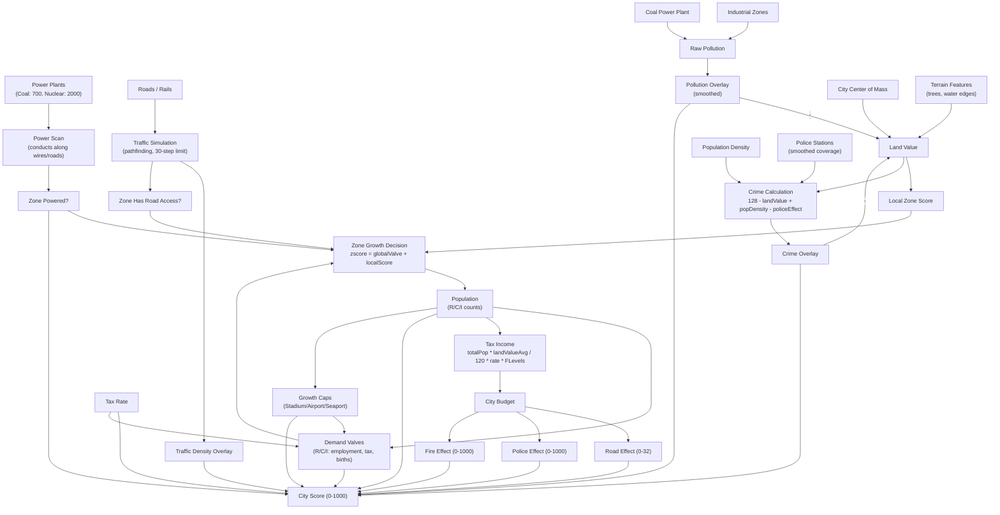

# Micropolis Game Strategy Guide

> Source-of-truth reference for AI agents. Every number comes directly from the engine source code.
> Use this to reason about cause-and-effect before spending money or placing tiles.
> For experiential learnings (what worked/failed in past games), see `agent_memory.md`.

---

## 1. Buildable Objects

### Construction Costs

| Object | Tool | Size | Base Cost | Notes |
|--------|------|------|-----------|-------|
| Residential Zone | `RESIDENTIAL` | 3x3 | $100 | Houses up to 40 pop per zone |
| Commercial Zone | `COMMERCIAL` | 3x3 | $100 | Up to 40 pop per zone |
| Industrial Zone | `INDUSTRIAL` | 3x3 | $100 | Up to 32 pop per zone, causes pollution |
| Road | `ROADS` | 1x1 | $10 | Bridge over water: $50 |
| Rail | `RAIL` | 1x1 | $20 | Underwater tunnel: $100 |
| Power Line | `WIRE` | 1x1 | $5 | Underwater: $25 |
| Park | `PARK` | 1x1 | $10 | Boosts land value |
| Police Station | `POLICE` | 3x3 | $500 | Reduces crime in radius |
| Fire Station | `FIRE` | 3x3 | $500 | Reduces fire risk in radius |
| Coal Power Plant | `POWERPLANT` | 4x4 | $3,000 | 700 power units, causes pollution |
| Nuclear Power Plant | `NUCLEAR` | 4x4 | $5,000 | 2,000 power units, meltdown risk |
| Stadium | `STADIUM` | 4x4 | $5,000 | Unlocks residential growth cap |
| Seaport | `SEAPORT` | 4x4 | $3,000 | Unlocks industrial growth cap |
| Airport | `AIRPORT` | 6x6 | $10,000 | Unlocks commercial growth cap |

### Annual Maintenance Costs

| Item | Cost Formula | Details |
|------|-------------|---------|
| Police Station | $100 per station per year | Underfunding reduces `policeEffect` |
| Fire Station | $100 per station per year | Underfunding reduces `fireEffect` |
| Roads + Rails | `(roadTiles + railTiles * 2) * RLevels[difficulty]` | Rails cost 2x roads in maintenance |
| Road bridges | Count as 4 road tiles each | Higher maintenance |

**Difficulty multipliers (`RLevels`):** Easy=0.7, Medium=0.9, Hard=1.2

**Tax income multiplier (`FLevels`):** Easy=1.4, Medium=1.2, Hard=0.8

---

## 2. Simulation Systems — Dependency Graph



### Key Causal Chains

1. **Power -> Growth:** Without power, `zscore = -500` — zones cannot grow regardless of demand.
2. **Roads -> Growth:** Without road access, `localScore = -3000` (residential/commercial) or `-1000` (industrial) — nearly guaranteed shrinkage.
3. **Pollution -> Land Value -> Crime -> Land Value:** Industrial zones and coal plants create pollution, which lowers land value, which raises crime, which further lowers land value. A reinforcing negative loop.
4. **Tax Rate -> Valves -> Growth -> Population -> Tax Income:** Higher taxes suppress demand valves, slowing growth and reducing the tax base. Lower taxes stimulate growth but reduce per-capita income.
5. **Funding -> Score:** Underfunded police/fire/roads directly penalize the city score through multiplicative factors.

---

## 3. Zone Growth Mechanics

Growth and shrinkage are evaluated per zone tile every 8 simulation cycles (1/8 chance per cycle, except empty residential zones which are checked every cycle).

### Growth Decision Formula

```
zscore = globalValve + localScore

if (!powered)  zscore = -500

GROW  if: zscore > -350  AND  (zscore - 26380) > random(-32768..32767)
SHRINK if: zscore <  350  AND  (zscore + 26380) < random(-32768..32767)
```

The random comparison means: at `zscore = 0`, growth probability is roughly 50%. Strongly positive zscore nearly guarantees growth; strongly negative nearly guarantees shrinkage.

### Local Score Functions

| Zone Type | Function | Formula | Range |
|-----------|----------|---------|-------|
| Residential | `evalResidential` | `max(0, landValue - pollution) * 32`, capped at 6000, then `-3000` | -3000 to +3000 |
| Commercial | `evalCommercial` | `comRate[y/8][x/8]` (distance to city center of mass: `64 - dist/4`) | ~0 to +64 |
| Industrial | `evalIndustrial` | Traffic OK? `0`. No road? `-1000` | -1000 or 0 |

**Implication:** Residential growth is highly sensitive to land value and pollution. Commercial growth favors locations near the city center. Industrial growth is indifferent to location quality — only power and road access matter.

### Value Classes (Building Appearance)

`getCRValue()` determines which density/quality variant gets placed:

| Class | Land Value - Pollution | Meaning |
|-------|----------------------|---------|
| 0 | < 30 | Slum / low-quality |
| 1 | 30–79 | Low-medium |
| 2 | 80–149 | Medium-high |
| 3 | >= 150 | Premium |

### Population Per Zone

- **Residential:** 0, 16, 24, 32, 40 (density levels), plus up to 8 individual houses around empty zones
- **Commercial:** 0 to 40 in steps of 8 (5 density levels x 4 value classes)
- **Industrial:** 0 to 32 in steps of 8 (4 density levels), pollution value 50

---

## 4. Demand System (Valves)

The three valves (`resValve`, `comValve`, `indValve`) represent global demand pressure. They are updated every ~2 simulation weeks via `setValves()`.

### Valve Update Formula

```
employment   = (historyCom + historyInd) / normResPop    // job availability
migration    = normResPop * (employment - 1)
births       = normResPop * 0.02
projectedRes = normResPop + migration + births

laborBase    = clamp(historyRes / (historyCom + historyInd), 0.0, 1.3)
internalMkt  = totalPop / 3.7
projectedCom = internalMkt * laborBase

projectedInd = indPop * laborBase * difficultyFactor
               // Easy=1.2, Medium=1.1, Hard=0.98; minimum 5

ratio        = clamp(projected / actual, max 2.0)
delta        = (ratio - 1) * 600 + TaxTable[taxEffect + gameLevel]

valve       += delta   // accumulates over time
```

### TaxTable (index 0–20)

```
[200, 150, 120, 100, 80, 50, 30, 0, -10, -40, -100,
 -150, -200, -250, -300, -350, -400, -450, -500, -550, -600]
```

Index = `taxEffect + gameLevel`. Lower index = more growth stimulus. At index 7 (neutral), TaxTable = 0. Above 7, increasingly negative — actively suppresses demand.

**Key insight:** On Easy (gameLevel=0), a tax rate that produces `taxEffect=7` gives TaxTable[7]=0 (neutral). On Hard (gameLevel=2), the same taxEffect gives TaxTable[9]=-40 (penalty). Keep taxes lower on harder difficulties.

### Valve Ranges

| Valve | Min | Max |
|-------|-----|-----|
| Residential | -2000 | +2000 |
| Commercial | -1500 | +1500 |
| Industrial | -1500 | +1500 |

### Growth Caps (Critical Thresholds)

| Cap | Condition | Effect | Solution |
|-----|-----------|--------|----------|
| `resCap` | `resPop > 500` AND no Stadium | `resValve` clamped to 0 (no positive growth) | Build Stadium ($5,000) |
| `comCap` | `comPop > 100` AND no Airport | `comValve` clamped to 0 | Build Airport ($10,000) |
| `indCap` | `indPop > 70` AND no Seaport | `indValve` clamped to 0 | Build Seaport ($3,000) |

Additionally, each active cap multiplies the city score by **0.85** (15% penalty).

---

## 5. Overlay Systems

### Land Value

Calculated per 2x2 tile block in `ptlScan()`:

```
landValue = distanceToCenter + terrainBonus - pollution
if (crime > 190): landValue -= 20
if (no developed land in block): landValue = 0
```

Factors that increase land value: proximity to city center, trees/water edges (terrain), parks, low pollution, low crime.

### Pollution

Source: tile-level `pollutionValue` attribute from `tiles.rc`. Industrial zones and coal plants are the primary sources (pollution=50 for industry, pollution=100 for coal/ports). Smoothed across the map.

### Crime

```
crime = 128 - landValue + populationDensity - policeEffect
```

Clamped to 0–255. High density + low land value + no police = maximum crime.

### Police / Fire Coverage

- Stations contribute to an 8x8-cell grid map
- Value per station = `effect` (from budget funding); halved without power; halved again without adjacent road
- Grid is smoothed 3 times — creating a soft falloff, not a hard radius
- Effective coverage: roughly 15–20 tiles from station center

### Traffic

- Only **road tiles** accumulate traffic density (not rail tiles)
- Rail tiles count for pathfinding and route access, but generate no congestion
- Traffic decays over time (`decTrafficMem`)
- Traffic average is factored into score via the TRAFFIC problem

---

## 6. Scoring System

Score is calculated every `TAXFREQ=48` city-time units (coincides with tax collection).

### Step 1: Problem Severity

| Problem | Formula | Range |
|---------|---------|-------|
| Crime | `crimeAverage` | 0–255 |
| Pollution | `pollutionAverage` | 0–255 |
| Housing | `round(landValueAverage * 0.7)` | 0–~178 |
| Taxes | `cityTax * 10` | 0–200 |
| Traffic | `trafficAverage * 2.4` | 0–~612 |
| Unemployment | `clamp((resPop / ((comPop+indPop)*8) - 1) * 255, 0, 255)` | 0–255 |
| Fire | `min(firePop * 5, 255)` | 0–255 |

### Step 2: Base Score

```
avgProblem = sum(allProblems) / 3     // note: /3, not /7 — problems stack harshly
avgProblem = min(avgProblem, 256)
baseScore  = clamp((256 - avgProblem) * 4, 0, 1000)
```

### Step 3: Multiplicative Penalties

| Condition | Penalty |
|-----------|---------|
| `resCap` active | x 0.85 |
| `comCap` active | x 0.85 |
| `indCap` active | x 0.85 |
| `roadEffect < 32` | `- (32 - roadEffect)` |
| `policeEffect < 1000` | x `(0.9 + policeEffect/10000.1)` |
| `fireEffect < 1000` | x `(0.9 + fireEffect/10000.1)` |
| `resValve < -1000` | x 0.85 |
| `comValve < -1000` | x 0.85 |
| `indValve < -1000` | x 0.85 |

### Step 4: Population Growth Bonus/Penalty

```
if deltaCityPop > 0:  multiplier = deltaCityPop/cityPop + 1.0  (bonus)
if deltaCityPop < 0:  multiplier = 0.95 + deltaCityPop/(cityPop - deltaCityPop)  (penalty)
```

### Step 5: Final Adjustments

```
score -= firePop * 5        // active fires reduce score
score -= cityTax             // raw tax rate subtracted
score *= poweredZones / totalZones   // unpowered zones directly penalize
score  = clamp(score, 0, 1000)
```

### Step 6: Smoothing

```
cityScore = round((oldCityScore + newScore) / 2)
```

The score is a **moving average** — it takes multiple evaluation periods to fully reflect changes. Sudden improvements only move the score halfway toward the new value.

---

## 7. Budget Mechanics

### Tax Income Formula

```
taxIncome = round(lastTotalPop * landValueAverage / 120 * taxRate * FLevels[gameLevel])
```

Higher land value = more tax per capita. This creates a virtuous cycle: investing in land value (parks, police, low pollution) increases revenue.

### Budget Allocation (Auto-Budget Priority)

When funds are insufficient, the engine allocates in this priority:
1. **Roads/Rails** (funded first)
2. **Fire Stations** (funded second)
3. **Police Stations** (funded last)

### Effect Calculation

- `roadEffect`: 0–32 scale. Full funding = 32. Below 32 directly subtracts from score.
- `policeEffect`: 0–1000 scale. Below 1000, score multiplied by `0.9 + effect/10000.1`.
- `fireEffect`: 0–1000 scale. Same formula as police.

---

## 8. Disasters

### Random Disaster Probability

Checked every simulation cycle 15. Probability: `1 / (disChance[level] + 1)` per check.

| Difficulty | `disChance` | Approx. Frequency |
|------------|-------------|-------------------|
| Easy | 480 | ~1 per 480 cycles |
| Medium | 240 | ~1 per 240 cycles |
| Hard | 60 | ~1 per 60 cycles |

### Disaster Types

| Disaster | Trigger Condition | Notes |
|----------|------------------|-------|
| Fire | Random | Spreads if no fire station coverage |
| Flood | Random | Creates flood tiles, temporary |
| Tornado | Random | Mobile sprite, destroys tiles in path |
| Earthquake | Random | Damages random tiles city-wide |
| Monster | Random, only if `pollutionAverage > 60` | Keep pollution below 60 to prevent |
| Nuclear Meltdown | Per-cycle chance per nuclear plant | Chance: `1/(MELTDOWN_TAB[level]+1)` — Easy: 1/30001, Medium: 1/20001, Hard: 1/10001 |

---

## 9. Strategic Implications

### Priority Order for City Building

1. **Power first** — Without power, zscore = -500. Nothing else matters until zones are powered.
2. **Road access second** — Without roads, localScore = -3000 (res/com) or -1000 (ind). Connect every zone.
3. **Demand balance** — Check valves before building. Negative valve + building that zone = wasted money.
4. **Pollution separation** — Industrial zones and coal plants must be far from residential. The pollution->landValue->crime chain is devastating.
5. **Services for score** — Police and fire stations are multiplicative score factors. Underfunding them is a direct score penalty.

### Optimal Tax Strategy

The TaxTable index is `taxEffect + gameLevel`:
- **Indices 0–7** provide a **positive** stimulus to demand valves (+200 down to 0)
- **Index 8+** creates **negative** pressure (-10 and worse, down to -600)

Practical guidance:
- **Early game:** Keep taxes at 4–5% to maximize growth stimulus
- **Mid game:** 6–7% is sustainable; demand stays slightly positive
- **Avoid:** Tax rates above 10% create severe negative valve pressure and a score penalty of `tax * 10` in the problems table

### When to Build Key Infrastructure

| Building | Build When | Why |
|----------|-----------|-----|
| Stadium | `resPop` approaching 500 | Prevents residential growth cap + 15% score penalty |
| Seaport | `indPop` approaching 70 | Prevents industrial growth cap + 15% score penalty |
| Airport | `comPop` approaching 100 | Prevents commercial growth cap + 15% score penalty |
| Police Station | Every ~15 tiles of developed area | Crime formula: without police, high-density areas become high-crime |
| Fire Station | Every ~15 tiles of developed area | Reduces fire problem score; coverage halved without power or road |

### Zone Placement Strategy

- **Residential:** Place in high land-value areas (near city center, away from pollution, near water/trees). Land value directly controls growth score and building quality.
- **Commercial:** Place near city center (comRate = `64 - distance/4`). Commercial growth is driven by proximity to center of mass.
- **Industrial:** Location quality is irrelevant to growth (only traffic matters). Place far from residential to avoid pollution damage. Group near seaport when available.
- **Parks:** Place near residential zones to boost land value (and thus growth, building quality, and tax revenue).

### Rail vs. Road

- Rails count for **pathfinding** (zone connectivity) just like roads
- Rails generate **no traffic congestion** on the overlay (only roads do)
- Rails cost **2x maintenance** per tile compared to roads
- **Use rails** in high-traffic corridors to reduce congestion without losing connectivity
- **Use roads** for general coverage (cheaper maintenance, but creates traffic)

### Score Optimization Checklist

1. Keep all zones powered (unpowered ratio directly multiplies score)
2. Build Stadium/Seaport/Airport before caps activate (each cap = -15%)
3. Fund roads to `roadEffect = 32` (below this, direct score subtraction)
4. Fund police/fire to `effect = 1000` (below this, multiplicative penalty)
5. Keep all three valves above -1000 (each below = -15% score penalty)
6. Grow population (positive deltaPop = score bonus)
7. Minimize crime (police + land value), pollution (separate industry), traffic (use rail)
8. Keep taxes moderate (raw tax rate is subtracted from score)
9. Prevent fires (fire stations + funding)

### Reward Signal Alignment

The agent reward formula is: `reward = (delta_score * 2) + (delta_population / 100) + (delta_funds / 500)`

- **delta_score** has highest weight — optimize for score above all
- Score is a moving average — improvements take 2+ evaluation periods to fully register
- Avoid large cash expenditures without immediate score/population payoff (delta_funds penalty)
- Population growth contributes but is secondary to score improvement

---

## 10. Reference

- **Source files:** `Micropolis.java`, `MapScanner.java`, `TrafficGen.java`, `CityEval.java`, `MicropolisTool.java`
- **Experiential memory:** `agent_memory.md` — records what strategies worked or failed in actual games
- **System prompt:** `SystemPrompt.java` — defines the agent's interface, available tools, and reward formula
